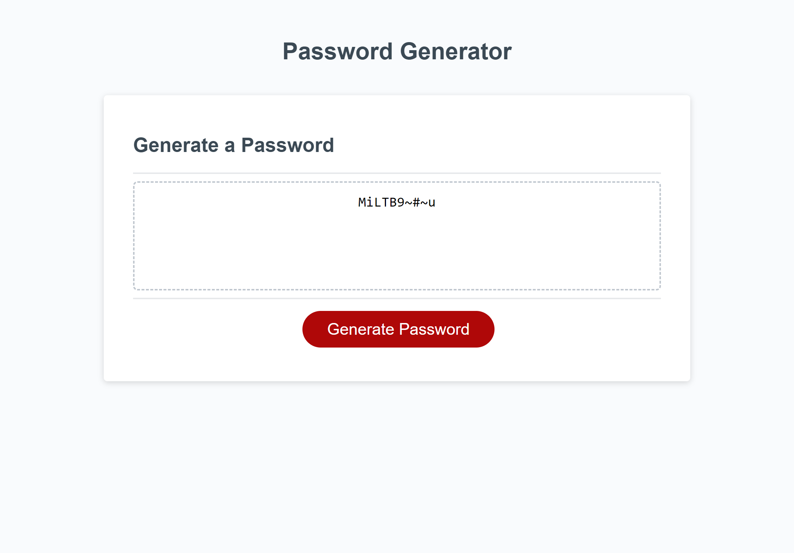

# password-generator

## Description

The goal of this project was to display a password with the correct amount and type of characters that the user selected. I took on this task in order to better understand how to solve a problem using JavaScript. While working on this project, I learned about the importance of pseudo coding to help break down a complex problem into smaller pieces. I also became more comfortable using if statements and array methods. I learned how to use prompt and confirm methods in order to have the user select what they want. My biggest challenge was utilizing a for loop to ensure that the length of the password was accurate. After lots of trial and error, I successfully made the for loop and feel more comfortable next time I have to use one.

## Installation

N/A

## Usage

To use the password generator, click the "Generate Password" button in the deployed live application. Users can input how many characters they would like their password to contain. If the length is less than 8 characters or more than 128 characters, another prompt will display telling the user to please select a number between this range. Next, the user will be asked to confirm whether or not they would like special, numeric, lowercase and/or uppercase characters. The user can click "ok" to acknowledge that they would like this type of character or "cancel" to communicate that they would not like this type. Once the user is done answering these questions, their password will be displayed in the box.

Link to deployed application: https://mnettath.github.io/password-generator/

## Credits

N/A

## License

N/A
